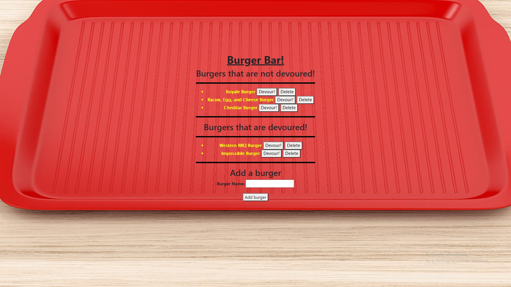

# burger-builder

## Preview

## Description

The application prompts the user for the burger they would like to add, allowing the user to devour or delete the burger when prompting so. The purpose of the assignment was to demonstrate the ability to use CRUD in conjuction with mysql and dbeaver to create an interactive webpage using a command line application that tracks information in our local database.

## Table of Contents 
* [Installation](#installation)
​
* [Usage](#usage)
​
* [License](#license)
​
* [Contributing](#contributing)
​
* [Tests](#tests)
​
* [Questions](#questions)
​
## Installation

​To install necessary dependecies please use the following commands:

	npm i
	
## Usage
​
N/A
​​
## License
MIT
	

## Contributing
​
You may not contribute to the repo at this time.
​
## Tests
​
none

## Questions
​
If you have any questions, comments, or concerns please feel free to contact me at castroal96@gmail.com or on Github: [CastroAlejandro](https://github.com/CastroAlejandro).

